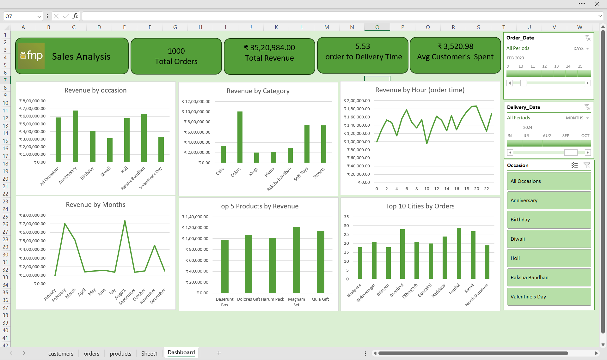

# Sales Analysis Dashboard – Excel Project

## Project Overview

This project presents an interactive Sales Analysis Dashboard developed using Microsoft Excel. The objective is to analyze sales performance, customer purchasing behavior, product trends, and operational efficiency using structured datasets.

The dashboard transforms raw transactional data into meaningful business insights using pivot tables, data modeling, KPI metrics, and visual analytics.

---

## Business Objectives

- Analyze overall revenue performance
- Identify top-performing products and categories
- Evaluate monthly and hourly sales trends
- Measure order-to-delivery time
- Identify top cities by order volume
- Support data-driven decision-making

---

## Tools and Technologies Used

- Microsoft Excel
- Pivot Tables
- Pivot Charts
- Slicers
- Data Cleaning and Transformation

---

## Key Metrics

- Total Orders: 1000
- Total Revenue: ₹35,20,984
- Average Order-to-Delivery Time: 5.53 Days
- Average Customer Spend: ₹3,520.98

---

## Dashboard Preview

---

## Project Structure

Sales-Analysis-Excel-Project  
│  
├── data/  
├── dashboard/  
├── problem_statement/  
├── screenshots/  
└── README.md  

---

## Business Value

This dashboard enables stakeholders to monitor performance, identify growth opportunities, and optimize operational efficiency through structured data analysis.

---

## Future Improvements

- Sales forecasting
- Customer segmentation
- Power BI implementation
- Automated data refresh pipeline
